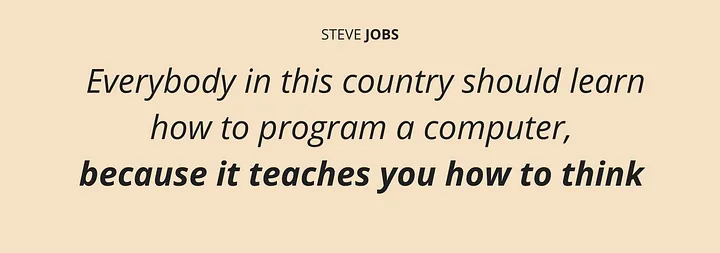

# C Programming👨‍💻Language Course 👨‍🏫
# Repository Struct
# Intro to computer science World
I’m one of those who feel that programming languages have made our lives more complex, and we often struggle to understand them as seamlessly as a computer does. Before diving deep into the C language, we’ll take a brief look at how computers "think" and how they work. So, grab a cup of coffee and enjoy learning the basics of programming languages, one sip at a time!
<div align="center">

</div>

### How Computers Work
1. **Hardware Basics:**
The core of a computer is its Central Processing Unit (CPU), which performs calculations and executes instructions.
- The Memory (RAM) stores data temporarily for quick access.
- Storage (HDD/SSD) stores data permanently.
- Input/output devices (like keyboards, screens) allow interaction with the system.
2. **Binary Operations:**
- Computers only understand binary (0s and 1s) because their hardware operates with electrical signals (on/off states).
- All instructions and data are converted into machine code, a binary representation.
3. **Execution Cycle:**
- The CPU fetches an instruction from memory, decodes it, and executes it. This process is called the Fetch-Decode-Execute Cycle.
4. **Software:**
- Software is a set of instructions that tell the hardware what to do. These instructions can range from high-level code to low-level machine code.
### What is a programming language?
A programming language is a formal language for us. It helps us to communicate with the computer and ask it for our desired output. Programming languages consist of a set to instructions that we give just like sentences or statements we say to another human being which communicating.
### Why Do We Have High-Level and Low-Level Languages?
1. **Low-Level Languages:**
- These are closer to machine code and give more control over hardware.
- Examples: Assembly language, Machine code.
- They are faster and more efficient but difficult for humans to read and write.
- Used for: Embedded systems, performance-critical applications.
2. **High-Level Languages:**
- These are abstracted from hardware and easier for humans to understand and write.
- Examples: C, JavaScript, C++, Java... 
- They use compilers or interpreters to translate high-level code into machine code.
- Used for: Application development, web development, AI, etc.
# what is C Language 
C It was created in the 1970s 🗓 by **Dennis Ritchie**.
C is a general-purpose, procedural programming language that allows for low-level memory manipulation. It works by providing developers the ability to write code that can be compiled and executed on different platforms with efficiency. C is widely used for system-level programming [](like operating systems, compilers, etc.) and applications that require direct interaction with hardware.
# History of C
- 1969-B Language word Oriented (i.e not Byte oriented)
- 1972-C Multiple Type including(Byte/Character)
- 1972-1978-C and UNIX co-evolved with a goal of increasingly less assembly language in UNIX
- 1978-K& R C 
- 1989-C89/ANSI void type, C++ Declarations , Character sets locales
- 1990-C90/ISO C  
- 1999-C99-Complex Type,// comments Unicode 
- 2011-C11-Library Improvements
- 2018-C17 Cleanup Of C11 
# Uses of C ??
C language is used to programming a wide variety of 
systems one of the uses of are as follows.
- Major parts of Windows and linux and often operating system are written in C
- C is Used to Write device programming language and like Tablets Camera  
- C language is used to program embedded systems where programs need to run faster in limited memory 
- C is used to develop games an area where latency is very important 
# How C Language Works
**1 The main Function in C.**
In C, every program starts with the main function. This function is the entry point, where the execution of a program begins. Here’s an example of a simple main function:
```c
#include <stdio.h>

int main() {
    printf("Hello, World!\n");
    return 0;
}
/**
 * int main(): The main function returns an integer to the operating system (typically 0 to indicate successful execution).printf: Outputs text to the console. return 0: Indicates that the program has ended successfully.
 */
```
C is a compiled language, which means that the code you write must be translated into machine code before it can be executed. This process involves several stages:
- Preprocessing: The preprocessor handles directives (like #include and #define), expands macros, and removes comments from the code.
- Compilation: The compiler translates the preprocessed code into assembly language.
- Assembly: The assembler converts the assembly code into machine code or object code.
- Linking: The linker combines the object code with necessary libraries and produces the final executable.
**C Compilers**
- GCC (GNU Compiler Collection): A widely used open-source compiler.
- Clang: A compiler front-end for the C language, part of the LLVM project.
- Microsoft Visual C++ (MSVC): Part of the Microsoft Visual Studio IDE.
- TinyCC (TCC): A lightweight, fast C compiler.
```c
gcc program.c -o program
```
